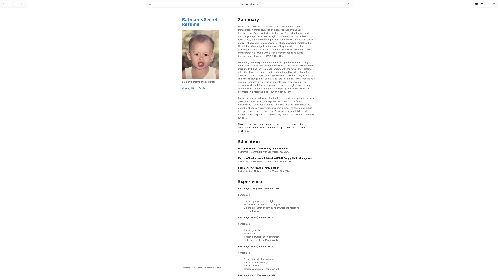
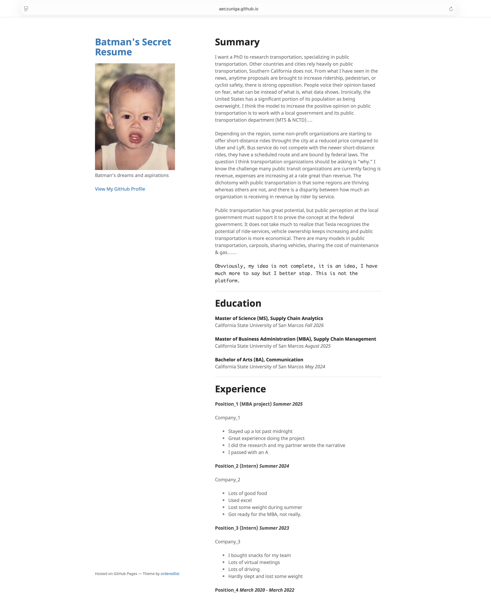
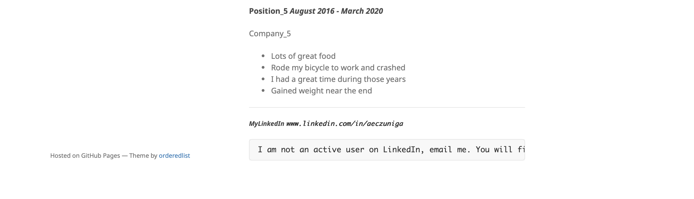
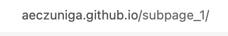

# **TASK 1**

## _INTRODUCTION_
**Milestone II** creates a second [index.md] file nested in the responsitory and main branch used in **Milestone I**, incorporating the second [index.md] file into the static webpage. If I delete the [/subpage_1/] from the url [https://aeczuniga.github.io/subpage_1/], the webpage defaults to the [index.md] from **Milestone I**. 
With the subpage folder, I can retain the same site, theme, and layout. 

In milestone I, I struggled and missed the deadline, GitHub's documents were not helpful. The instructions were not clear and thorough for me, it did not tell me that the purpose of [_config.yml] is to deploy the static webpage, nor did the [README.md] file from the `minimal-master` folder mention that.

## _STEPS from MILESTONE I_
    1. Create a respository titled aeczuniga.github.io, selecting an MIT license and creating a README.md file when launching
    2. Clone respository on computer using VSCode into a web-based folder like a personal OneDrive
    3. Download the [minimal-master] folder as a zip folder, open, and copy all contents into the repository on the computer
    4. Compy index.me, _config.yml files into main branch, out of the name folder
    5. select and export a photo as a headshot into the main branch
    6. utilize README.md file from main repository, **not minimal-master folder** , to configure _config.yml (static webpage)
    7. create content for index.md file to deply on static site
    8. In VSCode, commit, sync changes, push
## _ADDITIONAL RESOURCES_

## _PORTFOLIO SCREENSHOTS_
EXTRA STUFF

# **TASK 2**
After comple!ng Task 1, create a subpage in your e-por#olio with the newly created markdown file.

# **TASK 3**
Revisit your main page (in the root folder), and add a new section called projects with a link to the newly created subpage of Task 2.
[costco weblink](https://costco.com).
